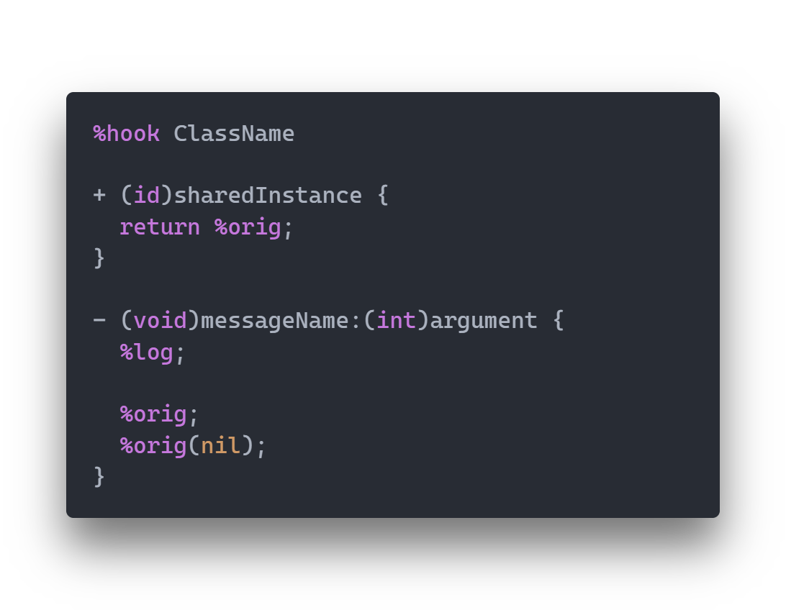

# Logos for VS Code
  

Provides syntax highlighting and formatting support for Logos files

Get it from the [Visual Studio Marketplace](https://marketplace.visualstudio.com/items?itemName=Renaitare.logos-vscode)

## Features
* Logos
	* Syntax Highlighting
	* Native File Formatter
* Objective C/C++
	* Support for Formatting
## Formatter
The formatter is powered by the **'clang-format'** executable included with LLVM. Simply enabling the format options in the *Logos* section of your preferences will allow you to format your documents.
The configuration requires that you link the path to your **'clang-format'** executable, however the default value assumes that it is in your path.

## Project
This project is open sourced on [Github](https://github.com/Renaitare/logos-vscode) under the [MIT](https://choosealicense.com/licenses/mit/) license and you may report issues or suggestions [here](https://github.com/Renaitare/logos-vscode/issues)

